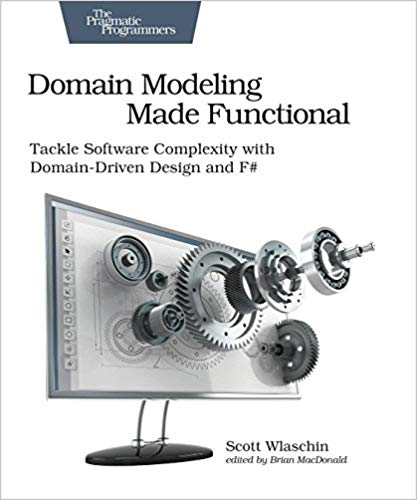

import { Head } from 'mdx-deck'
import { Notes } from 'mdx-deck'

<Head>
  <title>DDD</title>
</Head>

# Domain-Driven Design

<Notes>
It supposes to be an introductory presentation about DDD. I am going to share my experience with this topic so
far, and hopefully, it encourages and motivates you to learn about it yourself. We hope to open a discussion about DDD
with the presentation in this room, so it should not be lengthy to save time for later.
</Notes>

---

# My journey with DDD

<Notes>
I saw this acronym a few years ago but thought about it as something very backend specific(I was more in frontend and
DevOps development) and didn't pay attention to it.

Then I started being interested in microservices and reading books and articles about the best practices in the field.
All the materials I saw contained some DDD terminology - like "Bounded context" or "Ubiquitous language". It triggered
an interest in the topic, and I started reading about it, and it turned out to be a massive movement with its
traditions, best practices, and heroes.
</Notes>

---

# <a href='https://www.amazon.de/gp/product/1680502549/' target='_blank'>DDD with F#</a>

<Notes>
My FP interests dictated me to start with this book, and I believe it's a fantastic introductory book for someone who
wants to start with both functional programming and DDD. The author Scott Wlaschin is a long years practitioner and one
of the best explanators I know.

But it feels like I needed something more fundamental, something that can bring you to the next level.
</Notes>

---

# <a href='https://www.amazon.de/Domain-Driven-Design-Tackling-Complexity-Software/dp/0321125215/' target='_blank'>Blue book</a>

<Notes>
This one naturally pops up. Despite written more than 15 years ago, and it's a long time in software development, this
book is still in all recommendations, and nowadays experts often refer to it.

The book is a source of so much wisdom, and it was a great pleasure reading it. I agree that it's a must-read book for
a person involved in software development and highly recommend it.

This book is heavily based on OOP paradigm, but what's important is the ideas are the same, and in the end, it does
not matter what's your personal choice in terms of programming languages or other technologies. The domain is the god
here.
</Notes>

---

# DDD is not fit to any project

<Notes>
The projects that can benefit from DDD methodology usually serve the direct purposes of business. Something like
`Order creation` is the best candidate for DDD. But keep in mind that DDD is not for everything - game dev, system
programming, or very technical projects will not benefit from it.
</Notes>

---

# DDD terminology

* Ubiquitous language
* Core domain(<a href='https://blog.jonathanoliver.com/ddd-strategic-design-core-supporting-and-generic-subdomains/' target='_blank'>strategic design</a>)
* Bounded context
* Context map

<Notes>
UL - is a set of concepts and vocabulary that is associated with the domain and is shared by both the team members and
the source code.
Core domain -  is this 20% of the domain that brings 80% of the value.
Bounded context - is a subsystem in the solution space with clear boundaries that distinguish it from other subsystems.
Context map - is a map of bounded contexts that forms the whole system.
</Notes>

---

# What DDD values

* find your bounded context and keep refining it
* it will help if you focus on your core domain
* you should keep searching for a deeper model with the help of domain experts
<Notes>
The name DDD is self-explanatory, and it means that you should value your domain as the most valuable asset you have
because it will help you as an engineer to make the right decisions on architectural and implementational levels and
in the end to meet business requirements.
</Notes>

---

# Building blocks

* Entity
* Value object
* Aggregate
* Domain event
* Service
* (Repository)
* (Factory)

<Notes>
Entity - is something that has an identity and might change during time in your domain. E.g., `Order` or `Subscription`.
Value object - is something that does not have a strong identity and can be interchanged in your domain and is immutable. E.g., `Address`.
Aggregate - is a collection of objects that are bound together by a root entity; you can treat Aggregate as one unit. E.g., `Order`.
Domain Event - any event that we care about in the domain. E.g., `OrderWasCreated`.
Service - something that does not belong to the domain but is required. E.g., `ValidateAddress` in `Order creation domain`.
</Notes>

---

# Event storming

<a href='https://www.eventstorming.com/' target='_blank'>Event storming</a>

<Notes>
If you decided to follow DDD methodology, consider using EventStorming as the first step in modeling the domain.
</Notes>

---

# Other userful resources

* <a href='https://philippe.bourgau.net/misadventures-with-big-design-up-front/' target='_blank'>Misadventures with Big Design Up Front</a>
* <a href='https://domainlanguage.com/wp-content/uploads/2016/04/GettingStartedWithDDDWhenSurroundedByLegacySystemsV1.pdf' target='_blank'>Getting started with DDD when
surrounded by legacy systems</a>

---

# Let's talk about it
